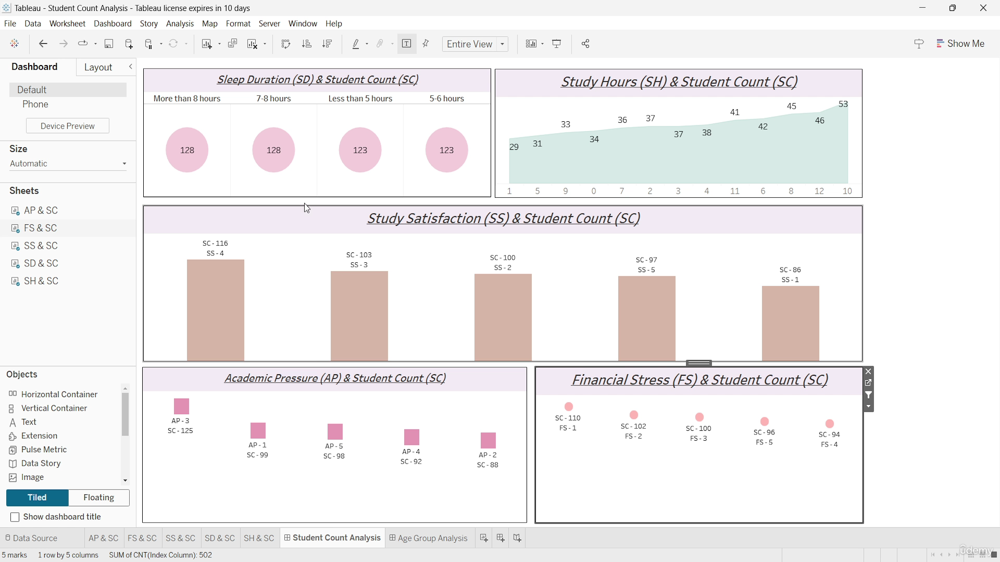
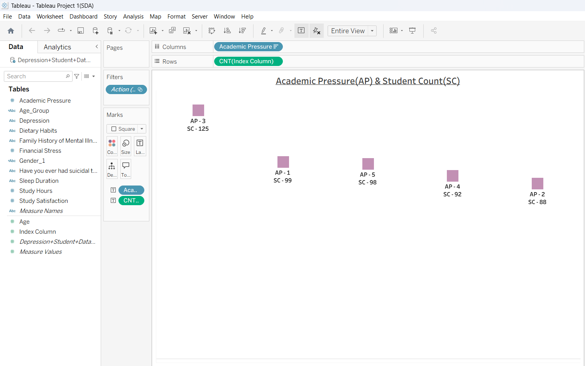
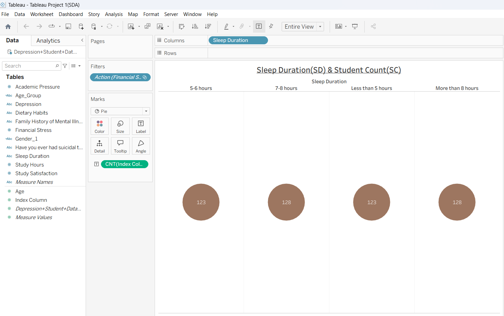
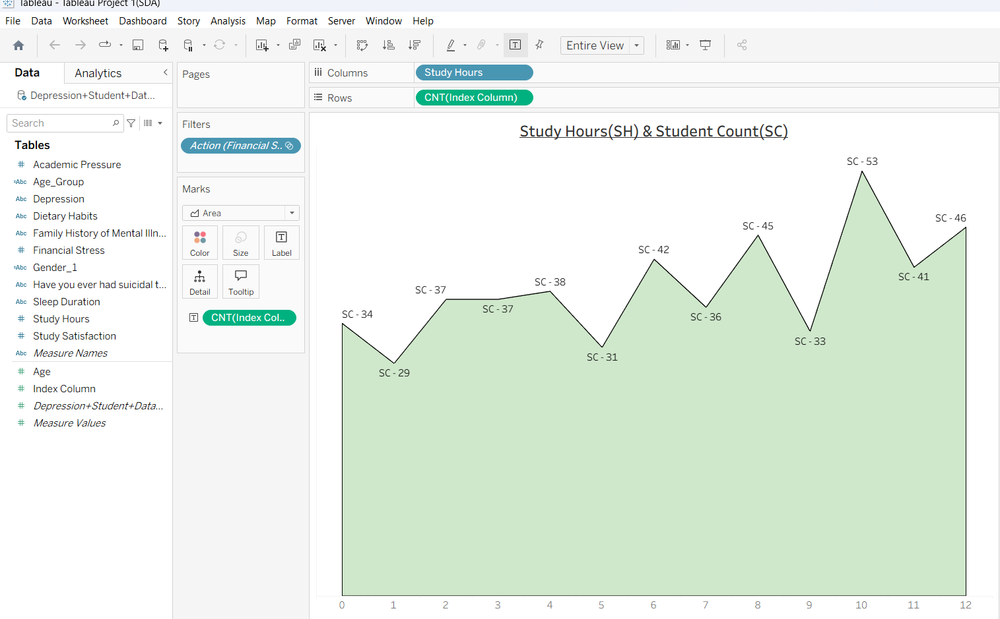
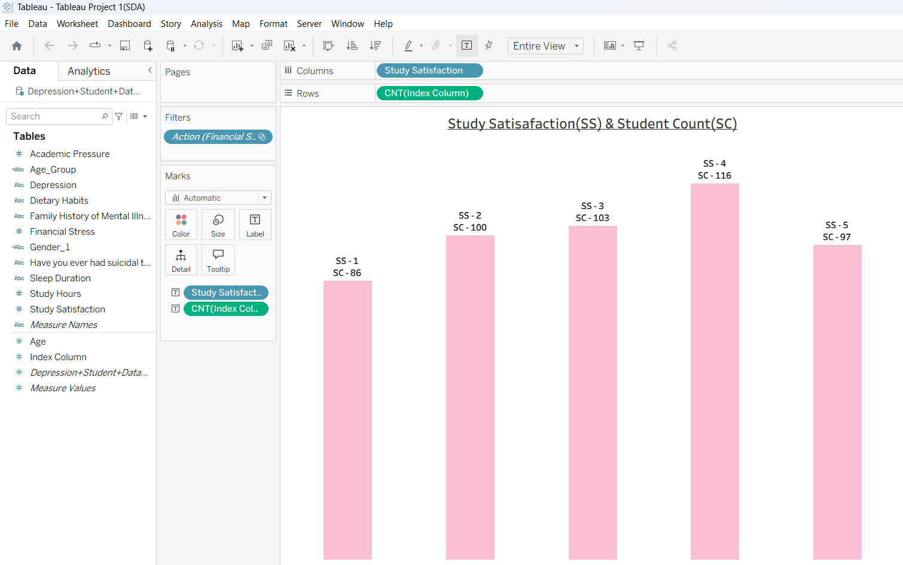

# 📊 Student Mental Health & Lifestyle Analysis Dashboard using Tableau

<p align="center">
  
</p>

---

# 📌 Project Description

This project is an interactive **Tableau Dashboard** developed to analyze various factors affecting students’ mental health, lifestyle, and academic performance.  

The dashboard provides insights into how:

- 📚 Academic Pressure  
- 💰 Financial Stress  
- 😴 Sleep Duration  
- ⏳ Study Hours  
- 😊 Study Satisfaction  

influence student behavior and overall well-being.

The visualizations help in identifying patterns and trends among students using different KPIs and charts.

---

# 🎯 Project Objectives

✔ Analyze stress and lifestyle patterns among students  
✔ Identify relationships between study habits and satisfaction  
✔ Understand student distribution across different categories  
✔ Create an interactive and visually appealing dashboard  
✔ Generate meaningful insights using Tableau visualizations  

---

# 🛠️ Tools & Technologies Used

| Technology | Purpose |
|------------|----------|
| **Tableau** | Dashboard & Data Visualization |
| **Excel / CSV Dataset** | Data Source |
| **Data Analytics** | Insight Generation |
| **Interactive Filters & Actions** | Dynamic Dashboard Analysis |

---

# 📂 Dataset Information

The dataset contains multiple student-related attributes including:

| Features |
|----------|
| Academic Pressure |
| Financial Stress |
| Sleep Duration |
| Study Hours |
| Study Satisfaction |
| Depression |
| Dietary Habits |
| Gender |
| Age |
| Age Group |
| Family History of Mental Illness |

---

# 📊 Dashboard Components

The dashboard contains multiple visualizations to analyze student behavior and mental health factors.

---

# 📚 1. Academic Pressure (AP) & Student Count (SC)

<p align="center">
  
</p>

## 🔍 Insights
- Academic Pressure level **3** has the highest student count (**125 students**).
- Academic Pressure level **2** has the lowest student count (**88 students**).
- Most students experience a moderate level of academic pressure.

---

# 💰 2. Financial Stress (FS) & Student Count (SC)

<p align="center">
  
</p>

## 🔍 Insights
- Financial Stress level **1** has the highest student count (**110 students**).
- Financial Stress level **4** has the lowest count (**94 students**).
- Lower financial stress is more common among students.

---

# 😴 3. Sleep Duration (SD) & Student Count (SC)

<p align="center">
  
</p>

## 🔍 Insights
- Students sleeping **7-8 hours** and **more than 8 hours** show the highest count (**128 students**).
- Students sleeping **less than 5 hours** and **5-6 hours** show comparatively lower counts (**123 students**).
- Balanced sleep duration is common among most students.

---

# ⏳ 4. Study Hours (SH) & Student Count (SC)

<p align="center">
  
</p>

## 🔍 Insights
- Highest student count observed at **10 study hours (53 students)**.
- Lowest student count observed at **1 study hour (29 students)**.
- Student engagement generally increases with study hours.

---

# 😊 5. Study Satisfaction (SS) & Student Count (SC)

<p align="center">
  
</p>

## 🔍 Insights
- Study Satisfaction level **4** has the highest student count (**116 students**).
- Study Satisfaction level **1** has the lowest count (**86 students**).
- Most students show moderate to high study satisfaction.

---

# 🖥️ Complete Dashboard View

<p align="center">
  
</p>

---

# 📈 Key Findings

## ✅ Academic Pressure
Most students fall under moderate academic pressure levels, indicating a balanced academic environment.

## ✅ Financial Stress
Lower financial stress levels dominate, showing relatively stable financial conditions among students.

## ✅ Sleep Patterns
Students with healthier sleep durations represent the largest portion of the dataset.

## ✅ Study Habits
Higher study hours correspond to greater student participation and engagement.

## ✅ Study Satisfaction
Students generally report medium to high satisfaction levels regarding studies.

---

# ✨ Features of the Dashboard

✔ Interactive Tableau Dashboard  
✔ Dynamic Filters & Actions  
✔ KPI-Based Analysis  
✔ Multiple Visualization Types  
✔ Clean & User-Friendly Design  
✔ Student Lifestyle & Mental Health Insights  

---

# 📁 Project Structure

```bash
📦 Student-Mental-Health-Tableau-Project
│
├── 📂 Dataset
│   └── student_data.csv
│
├── 📂 Dashboard Images
│   ├── StudentCountAnalysis.png
│   ├── AcademicPressure(AP)&StudentCount(SC).png
│   ├── FinancialStress(FS)&StudentCount(SC).png
│   ├── SleepDuration(SD)&StudentCount(SC).png
│   ├── StudyHours(SH)&StudentCount(SC).png
│   └── StudySatisafaction)(SS)&StudentCount(SC).png
│
├── 📊 Tableau Workbook
│   └── Student_Mental_Health_Dashboard.twbx
│
└── README.md
```

---

# 🚀 Future Scope

🔹 Add Machine Learning prediction models  
🔹 Create gender-wise and age-wise dashboards  
🔹 Add real-time survey data integration  
🔹 Perform advanced statistical analysis  
🔹 Add geographical visualization features  

---

# 🧠 Learning Outcomes

Through this project, the following concepts were learned:

- Data Visualization using Tableau
- Dashboard Designing
- KPI Analysis
- Interactive Filtering
- Data Interpretation
- Insight Generation

---

# 👩‍💻 Author

## **Tishtha Gandhi**
### B.Tech CSE (AI & ML)

---

# 🌟 Connect & Support

If you found this project useful:

⭐ Star this repository  
🍴 Fork the repository  
📢 Share your feedback  

---

# 📌 Conclusion

This Tableau dashboard successfully analyzes student mental health and lifestyle-related factors using interactive visualizations and KPIs.  

The project demonstrates how data analytics can help in understanding student behavior, stress patterns, study habits, and satisfaction levels effectively.

---
